```{r knitrsetup,echo=FALSE,eval=TRUE,results="hide",error=FALSE,message=FALSE,warning=FALSE}
library(knitr)
opts_chunk$set(fig.width=8,fig.height=5.5,message=FALSE,error=FALSE,warning=FALSE,echo=TRUE,dev=c("svg"),comment=NA,out.width="750px",out.height="550px", fig.align='center')
library(eeptools)
library(ggplot2)
library(ggthemes)
require('hexbin')
source("data/simulate_data.R")
# load("data/cache.rda")
load("data/smalldata.rda")
```

## The Problem of Data Visualization

- Data use is increasing rapidly within the education space
- Policymakers are under increasing pressure to use data to inform decisions, 
justify funding, and guide practice
- **But,** policymakers are often **not** statisticians, researchers, or quants
- **Data visualization** is a way to bridge this gap
- Proper data visualization will bring the data to the audience in a way they can understand quickly and use to inform decisions

<div class="columns-2">

## Follow Along

### http://goo.gl/bhSzVJ


<p align="center"></p>

</div>

## What is dataviz?

<div class="columns-2">

### Dataviz is...
>- An exploratory tool for understanding datasets
>- A communication tool for framing decisions and depicting problems
>- A way to showcase 
>- A better way to present results of analyses
### Dataviz is not...
>- Easy
>- A replacement for analysis
>- Infographics
>- Easy!

</div>

## A Definition

<p><q>Data visualization is a tool for communicating <span class = 'red'>a 
specific feature</span> of a dataset in an approachable and efficient manner</q></p>


## The Challenge 

<p><q>If a picture is worth a thousand words, a good data visualization must 
always be <span class = 'red'>better than a table.</span></q></p>

## Student Growth

<p align="center">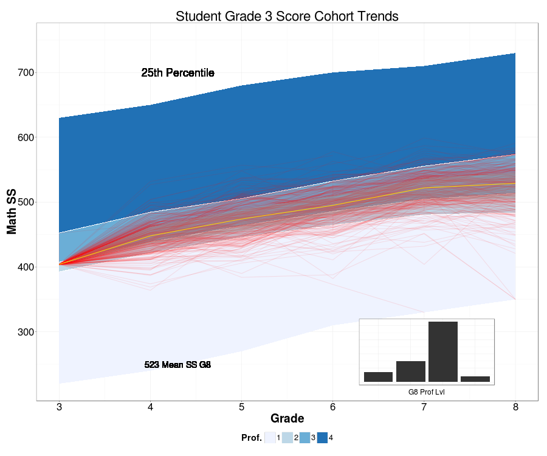</p>

## Objectives

1. Review data visualization principles
2. Look at applications in education data
3. Best practices and advice
4. Review tools to use
5. Activity!

## Example

How can we improve this simple scatterplot?

```{r plot, fig.height=5.5, fig.width=8.5,fig.align="center",out.width="700px",out.height="500px",echo=FALSE}
qplot(hp,qsec,data=mtcars)+theme_dpi()
```

## Principles {.smaller .columns-2}

- Elements of a chart
- Chart Types and Data Types
- Dimensionality
- Scale
- Complexity
- Technical details
- Beyond charts


```{r plot1,out.width="470px",out.height="330px",echo=FALSE}
qplot(hp,qsec,data=mtcars,geom="point")+theme_dpi()+geom_smooth()+
  labs(x="Horsepower",y="Quart. Mile Time",title="Power and Speed")
rm(PROBS,commonnames,grade,i,number_of_years)
```

```{r,echo=FALSE,results='hide'}
gc()
```

## Chart Elements

There are a few things that all charts need [most of the time!]:  

- **Axis labels** and a **title** : These make the chart self-explanatory
- A **legend** : How are visual cues mapped to data?
- A **scale** : How are units mapped to the visual space
- **Annotations** : Author and data source (depending on distribution)

> These add up to provide context and meaning to viewers who have not analyzed 
the dataset themselves.

## Dimensions {.smaller}

- Charts and data are made up of dimensions (e.g. a bar chart is *x* and *y*)
- Additional dimensions can be represented by additional aesthetics or chart 
elements (e.g. color, size, shape, etc.)
- Dimensions can also be shown by multiple plots (e.g. a filmstrip)
- **Smart use of dimensions allows us to increase the information density of our charts**


```{r echo=FALSE,out.width='720px',out.height='275px', fig.align='center'}
qplot(readSS,mathSS,data=df[df$grade<6,])+theme_dpi()+labs(title="Multidimensions")+facet_wrap(~grade,nrow=1)
```

## Rule of Dimensionality

<p><q> How you turn dimensions in the <span class = 'red'>data</span> into visual 
cues for your audience is everything.</q></p>

## Reviewing Chart Types


## Stacked Bar

<p align="center">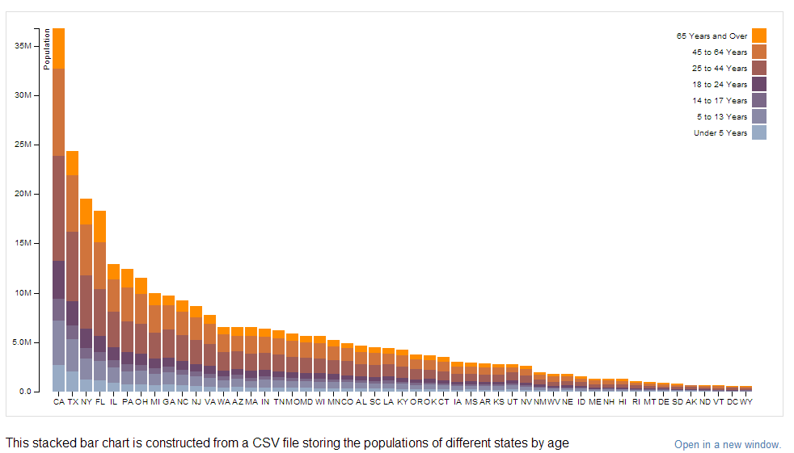</p>


## Box and Whisker

<p align="center">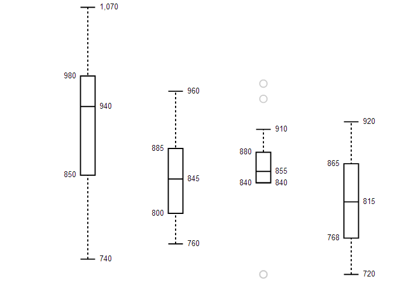</p>


## Bullet Chart

<p align="center">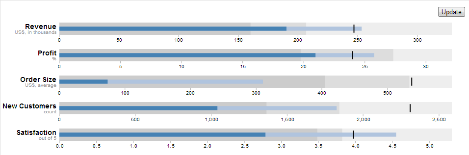</p>


## Calendar

<p align="center">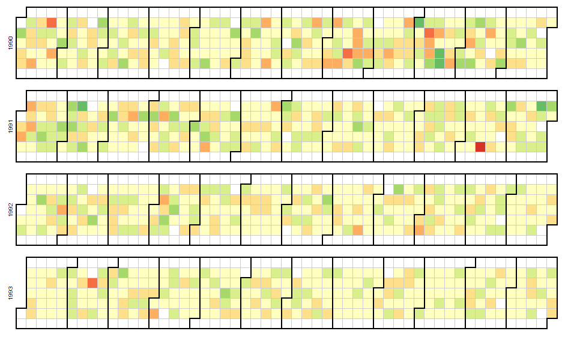</p>


## Lines

<p align="center">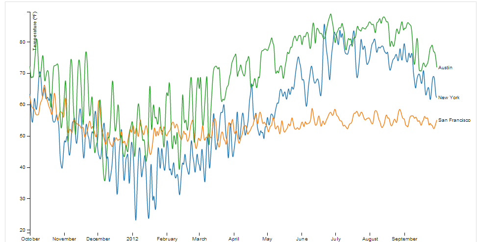</p>


## Parallel Sets

<p align="center">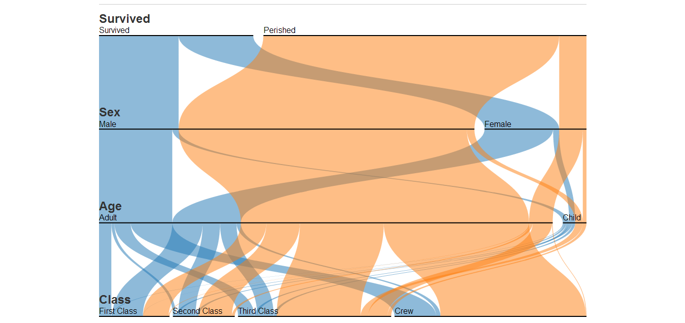</p>


## Tree Map

<p align="center">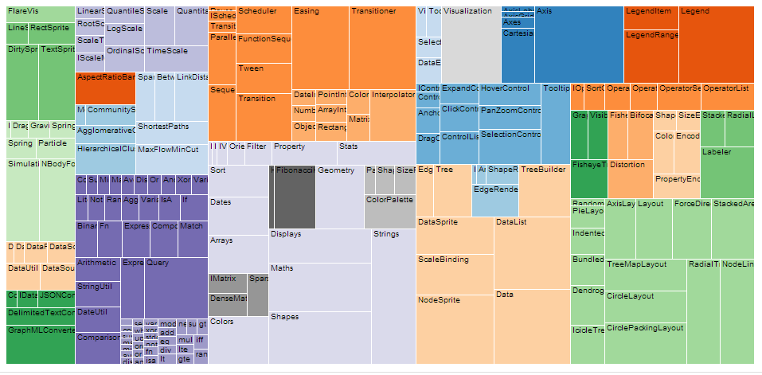</p>


## Word Cloud

<p align="center">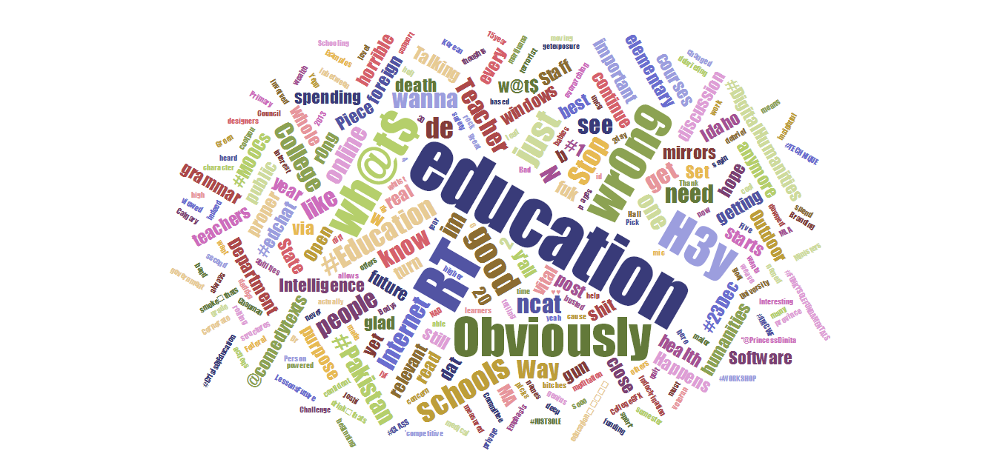</p>


## Data Types

- Any given dimension may be measured at different [levels of measure](http://en.wikipedia.org/wiki/Level_of_measurement) [derived by Stanley Smith Stevens in the 1940s and 50s]
  * Nominal: unordered categories of data (e.g. race)
  * Ordinal: ordered categories of data, relative size and degree of difference between categories is unknown (e.g. Likert scales, proficiency levels, etc.)
  * Interval: ordered categories of data, fixed width (e.g. grade level in school, GPA)
  * Continuous (ratio): a measurement scale in a continuous space with a meaningful zero (e.g. scale scores)


## Mapping Levels of Measure to Visual Cues

### Aesthetics for Mapping

How do we map levels of measurement onto visual features of charts?

Aesthetic |      Discrete              |  Continuous
----------|  ------------------------- | -------------------------------
Color     |  Disparate colors          |  Sequential or divergent colors
Size      |  Unique size for each value|   mapping to radius of value
Shape     |  A shape for each value    |   *does not make sense*

<!---
TODO: Add a plot showing examples of this here. 
-->

### Mapping That Does Not Work

```{r badscale}
mtcars$wt2 <- cut(mtcars$wt, breaks = quantile(mtcars$wt, probs = c(0, 0.25, 0.5, 
                                                                   0.75, 1)))
qplot(hp, mpg, data = mtcars, shape = factor(wt2)) + theme_classic() + 
  theme(legend.position = c(0.8, 0.8)) + 
  labs(x = "Horsepower", y = "MPG", shape = "Weight")

```

## Ordered vs. Unordered

Aesthetic  |    Ordered                         |  Unordered
---------- |  --------------------------------  |   -------------------------
Color      |  Sequential or divergent colors  |    Rainbow
Size       |  Increasing or decreasing radius |    *does not make sense*
Shape      |  *does not make sense*         |    A shape for each value

### Mapping That Does Not Work (2)

```{r badscale2}
mtcars$wt2 <- cut(mtcars$wt, breaks = quantile(mtcars$wt, 
                                               probs = c(0, 0.25, 0.5, 0.75, 1)))

qplot(carat, price, data = diamonds[sample(1:nrow(diamonds), 400), ], 
      size = as.numeric(cut), alpha = I(0.5)) + theme_classic() + 
  theme(legend.position = c(0.8, 0.2), legend.direction = 'horizontal') + 
  labs(x = "Carat", y = "Price", size = "Cut")

```


## Some tips

- Focus on the content and the context
- Know your audience, understand their limits, then push them!
- Use best practices, except when they don't help
- Experiment and iterate!

## Charting Categorical Data

```{r echo=FALSE,out.width="680px",out.height="520px",dev='svg'}
library(vcd)
load('data/smalldata.rda')
df$proflvl<-as.character(df$proflvl)
df$proflvl[df$proflvl=="below basic"]<-"minimal"
df$proflvl<-factor(df$proflvl,levels=c("advanced","proficient",
                                       "basic","minimal"))
mosaic(~race+proflvl,data=df,shade=TRUE)
```

## Charting Ordinal Data

```{r echo=FALSE}
df$proflvl <- factor(as.character(df$proflvl), levels = c("minimal", 
                                  "basic", "proficient", "advanced"))

qplot(proflvl,data=df,geom='bar')+theme_dpi()
```

## Charting Interval/Continuous Data

```{r echo=FALSE}

qplot(readSS,data=df)+theme_dpi()+labs(title="My Histogram")
```

## Maps

<p><q> Think like a <span class = 'red'>map</span>. Data density and easy interpretability.</q></p>

## Maps

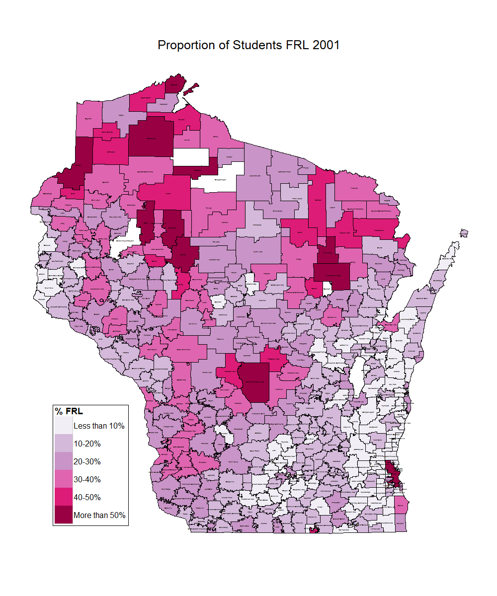

## Complexity

How do we display thousands or hundreds of thousands of observations with varying data types across multiple dimensions?

1. **Summarize the data**

  * Display summary statistics visually depicting the central tendency and spread of data

2. **Plot the raw data**

  * Annotate wisely to display the main message

3. **Model the data**

  * Use a statistical model to summarize features of the data

## Summarizing Data

- The most simple summaries are measures of central tendency, most easily understood
- It is important to look at the spread of data too though
- If time is of interest, we are interested in trends
- If space is of interest, we are interested in maps or spatial distributions
- **Think about context and reference**
- Let's look at an example summarizing student data to schools!

## Plotting Means

Here is a simple plot of mean school reading scores:

```{r plotmeans,echo=FALSE,out.height="500px"}
library(plyr)
schooldat<-ddply(student_long,.(schid,grade),
                 summarize,meanR=mean(readSS,na.rm=T),
                 meanM=mean(mathSS,na.rm=T),sdR=sd(readSS,na.rm=T),
                 sdM=sd(mathSS,na.rm=T),
                 count=length(readSS),
                 perminority=1-(length(race[race=="W"])/count))

qplot(factor(schid),meanR,data=schooldat[schooldat$schid<25 & schooldat$grade==3,],
      stat='identity')+theme_dpi()+labs(x="School",y="Mean Reading Score",title="Mean School Reading Scores in Grade 3")

```

But, what's wrong with this plot?

## Mistakes  {.columns-2}

- No sense of scale
- Means can be skewed
- Simple means are not meaningful
- With assessment scores we need to know grade distribution
- Let's try to improve this


```{r plotmeanssmall,echo=FALSE,out.width='400px',out.height='325px'}
qplot(factor(schid),meanR,data=schooldat[schooldat$schid<25 & schooldat$grade==3,],
      stat='identity')+theme_dpi()+labs(x="School",y="Mean Reading Score",title="Mean School Reading Scores in Grade 3")
```


## Adding a Dimension

```{r meanplot2,echo=FALSE}
schooldat$count<-schooldat$count+rnorm(length(schooldat$count),0,60)
qplot(factor(schid),meanR,data=schooldat[schooldat$schid<25 & schooldat$grade==3,],
      stat='identity',size=count)+theme_dpi()+labs(x="School",y="Mean Reading Score",title="Mean School Reading Scores in Grade 3", size = "Pupils") 
```

## Even More Dimensions

```{r meanplot3, echo=FALSE,dev='svg'}
ggplot(schooldat[schooldat$schid<25 & schooldat$grade==3,],
       aes(x=factor(schid),ymin=meanR-0.5*sdR,ymax=meanR+0.5*sdR,
                     color=perminority))+geom_errorbar(alpha=0.7)+
  geom_point(aes(y=meanR,size=count))+
  theme_dpi()+labs(x="School",y="Mean Reading Score",title="Mean School Reading Scores in Grade 3", size = "Pupils", color = "% Non-White")

```

## Annotation

We still aren't sure what the mean scale score means. Let's see a couple more additions that can make this useful. 

```{r meanplot4, echo=FALSE,out.width='750px',out.height='480px',dev='svg'}
ggplot(schooldat[schooldat$schid<25 & schooldat$grade==3,],
       aes(x=factor(schid),ymin=meanR-0.5*sdR,ymax=meanR+0.5*sdR,
                     color=perminority))+geom_errorbar(alpha=0.7)+
  geom_point(aes(y=meanR,size=count))+
  theme_dpi() + labs(x="School",y="Mean Reading Score",title="Mean School Reading Score", size = "Pupils", color = "% Non-White") +
  geom_hline(yintercept=421,color=I("red")) +
  geom_hline(yintercept=480,color=I("purple"))

```


## Caterpillar Plots

```{r catplot1, echo=FALSE,out.width='7250px',out.height='420px', dev="svg"}
ggplot(schooldat[schooldat$schid<25 & schooldat$grade==3,],
       aes(x=reorder(factor(schid), meanR),ymin=meanR-0.5*sdR,ymax=meanR+0.5*sdR,
                     color=perminority))+geom_errorbar(alpha=0.7)+
  geom_point(aes(y=meanR,size=count))+
  theme_dpi() + labs(x="School",y="Mean Reading Score",title="Mean School Reading Score", size = "Pupils", color = "% Non-White") +
  geom_hline(yintercept=421,color=I("red")) +
  geom_hline(yintercept=480,color=I("purple"))

# ggplot(schooldat[schooldat$grade==3 & schooldat$schid < 200,],
#        aes(x=reorder(factor(schid),meanR),ymin=meanR-0.1*sdR,ymax=meanR+0.1*sdR,
#            y = meanR, color=perminority))+geom_pointrange(alpha=0.9) + 
#   scale_color_continuous("Percent Minority") +
#   theme_dpi() + labs(x="School",y="Mean Reading Score",title="Mean School Reading Score", size = "Pupils", color = "% Non-White") +
#   geom_hline(yintercept=421,color=I("red"))+
#   geom_hline(yintercept=468,color=I("dark blue")) + 
#   theme(axis.text.x=element_blank(), panel.grid.major.x = element_blank(), 
#         axis.ticks = element_blank())

```

## Raw Data

Sometimes, we can get away with showing the raw data, that is, all data points. We may want to do this for a few reasons:

- the "wow" effect, 
- because it is easier, 
- or because it looks better aesthetically. 

How could it be done?

## 600,000 Observations Too Many

```{r rawdata1, echo=FALSE, dev='png', out.width = '740px' out.height = '550px'}
qplot(readSS,mathSS,data=student_long)+theme_dpi()+
  labs(x="Reading",y="Math",title="Relationship with Math and Reading")
```

## Strategies for Presenting Big Data

- Without reducing the data points we need to do one or more of three things to 
be successful

1. Spread the data out
2. Bin the data into groups
3. Annotate and add references

## Spreading the Data Out

1. **Repeat the plot for subgroups**  
  * Allow the viewer to draw comparisons across small plots
2. **Reduce the ink**  
  * Each point has too much "weight", so make them weigh less
3. **Add Reference Points**  
  * 600,000 observations in one panel is not meaningful and overwhelms the viewer

<!---
Talk about the small multiples.
Talk about the line of best fit through this data and how it is a model. 
--> 
## What About This

>- Edward Tufte and others recommend **small multiples**, a technique of repeating a plot across groups to compare relationships in multiple dimensions 

```{r rawdata2, echo=FALSE, dev='png', out.width = '575px', out.height = '550px'}
qplot(readSS, mathSS, data=student_long, alpha=I(0.01)) + facet_wrap(~grade) +\ 
  theme_dpi() + geom_smooth() +
  labs(x="Reading", y="Math", title="Relationship with Math and Reading by Grade")
```


## Even Smaller Multiples

```{r rawdata3,echo=FALSE,dev='png'}
qplot(readSS,mathSS,data=student_long,alpha=I(0.05))+facet_grid(race~grade)+
  theme_dpi() + geom_smooth() +
  labs(x="Reading",y="Math",title="Relationship with Math and Reading by Grade and Race")
```

## Binning Data

```{r rawdata4,echo=FALSE,dev='svg'}
qplot(readSS,mathSS,data=subset(student_long,grade==3),geom='hex')+
  facet_grid(econ~disab)+
  theme_dpi()+geom_smooth()+
  labs(x="Reading",y="Math",title="Relationship with Math and Reading \n FRPL and SwD Status")
```

## Modeling the Data

<p><q> All models are <span class = 'red'>wrong</span>. Some models are useful.</q></p>

## Smoothers 

```{r echo=FALSE,out.width='800px'}
ggplot(student_long[student_long$grade==5,],
       aes(y=readSS,x=mathSS,color=race))+
  geom_smooth(size=2)+theme_dpi()+
  labs(x="Math",y="Read",title="Smoothers of Assessment Score \n By Race")

```


## Comparing Model Performance

<p align="center">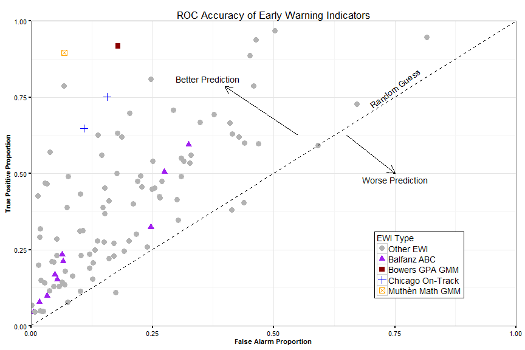</p>


## Aiding in Model Choice

<p align="center">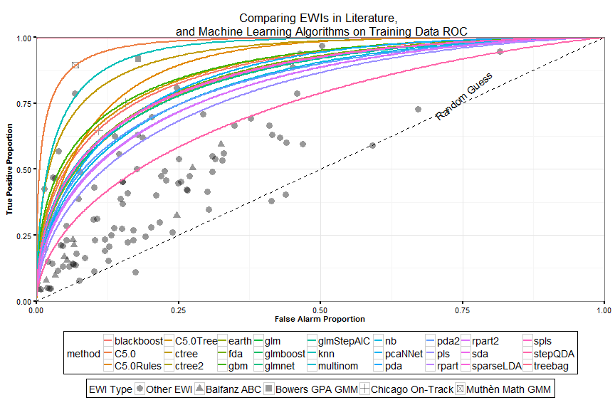</p>

## Regression Trees

<p align="center">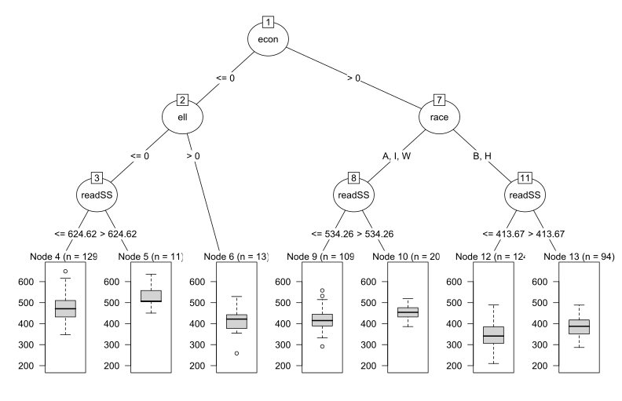</p>

## Illustrating a Model through Simulation

<p align="center">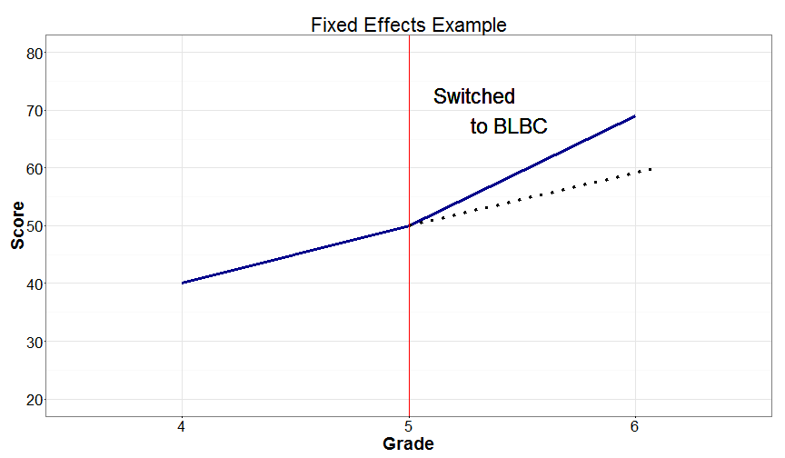</p>


## Simulating Outcomes

<p align="center">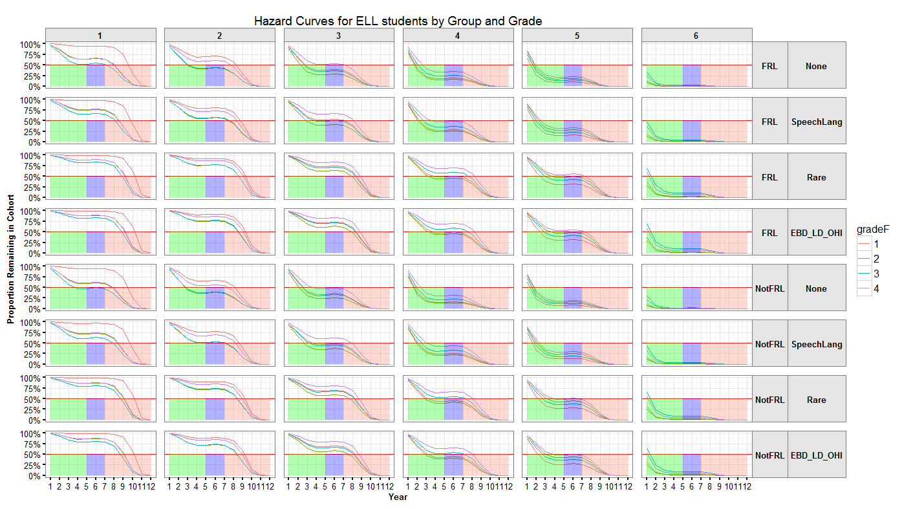</p>

## Combining Features

We can combine these features. 

>- Facets with smoother lines for references (small multiples + models)
>- Summary plots with raw data in the background
>- Reference lines and group comparisons

## Animation Example

<p align="center"></p>

## Why does this work?

>- Annotation
>- Labeling
>- Lots of data-ink
>- Reference points galore

## Some tips

>- Have a properly chosen format and design 
>- Use words, numbers and drawing together
>- Reflect a balance, a proportion, relevant scale
>- Display an accessible complexity of details
>- Have a narrative quality, tell a story
>- Avoid content-free decoration (Tufte's proverbial chartjunk)
>- Draw in a professional manner with an eye on the technical details
>- Provide your audience with the context they need and remember they haven't 
lived in the data like you!

## Themes

They can **communicate**, **confound**, **brand**, and **distract**

```{r plot2, echo=FALSE, fig.keep='all', fig.align='default'}
p1 <- qplot(hp,mpg,data=mtcars) + theme_economist()
p2 <- qplot(hp,mpg,data=mtcars) +  theme_tufte()
p3 <- qplot(hp,mpg,data=mtcars,color=factor(cyl)) + theme_excel()+scale_color_excel()
p4 <- qplot(hp,mpg,data=mtcars,color=factor(cyl)) + theme_stata()

grid.arrange(p1, p2, p3, p4, ncol = 2, nrow = 2)
```

## Technical Details 

<p><q>Don't forget them.</q></p>

## Graphics Files {.columns-2}

### Raster

- Files like **jpg** , **png** , **gif**. 
- Fixed scale, aspect ratio, and size
- Reasonable file size
- Viewable in almost any image viewing and editing system, including any modern web browser, PowerPoint, etc.

### Vector

- Files like **pdf** and **svg**
- Infinitely zoomable, adjustable on the fly
- Larger file size
- Viewable and usable in fewer systems. SVGs can be used in modern web browsers. PDFs included in other PDF reports. 

## Technologies

The technology you choose to do visualizations is largely a question of personal productivity, but with some important caveats:

- In the future, more and more content is going to be delivered in a paperless world, so pick a technology that can leverage web/tablet/phone interfaces
- Different technologies are useful for different levels of finish and polish; Adobe Illustrator is great for publication quality graphics, R is a great tool for rapidly prototyping different visualizations
- Chose a technology that best serves your **consumer**, not you the producer. Charts are a service to the consumer, not to the creator. 

## Programming vs. Illustrating

Keep in mind that depending on the project you may need to programatically make 
data visualizations, or you may need a highly customized illustrated graphic. 

## Some Opinions on Technologies

```{r technologies,echo=FALSE}
techs<-c("AI","R","Stata/SPSS","D3","Tableau","JavaScript","Processing","Excel","SAS")
speed  <-c(1,10,5,6,8,4,5,9,4)
quality<-c(10,8,5,9,7,8,9,2,4)
web<-c(1,1,0,1,0,1,1,0,0)
viz<-data.frame(techs=techs,speed=speed,quality=quality,web=web)

qplot(speed,quality,data=viz,geom="point",color=factor(web),size=I(4))+
  coord_cartesian(x=c(0,11),y=c(0,11))+theme_dpi()+geom_text(aes(label=techs),color="black",vjust=1.4,hjust=1)+theme(axis.text=element_blank(),axis.ticks=element_blank(),legend.position="bottom")+labs(color="Web Ready")+
  scale_color_manual(values=c("0"="brown","1"="purple"))+
  labs(title="Speed and Quality Tradeoffs in Viz Tech")
```


## Beyond Graphics

We have a number of other techniques we can use beyond simple charts. 

- Animations
- Interactive demos
- Summary tables
- Videos
- Web sites
- Simulations


## Group Exercise .{columns-2}

### Data

- Grade
- Disability Status
- Type of Disability
- Language Proficiency
- School
- Math Score
- Reading Curriculum
- Math Curriculum

### Example

```{r studentexample,echo=FALSE,out.width='420px',out.height='350px'}
qplot(attday,readSS,
      data=student_long[student_long$grade==3 & 
                          student_long$stuid %in% 
                          sample(student_long$stuid,8000,replace=FALSE),],color=race,alpha=I(0.5))+
  theme_dpi()+geom_smooth(method='lm',se=FALSE,size=1.1)+
  labs(title="Attendance and Assessment Scores Grade 3")
```


## Example

```{r studentexample2,echo=FALSE,out.width='700px',out.height='500px'}
qplot(attday,readSS,
      data=student_long[student_long$grade==3 & 
                          student_long$stuid %in% 
                          sample(student_long$stuid,8000,replace=FALSE),],color=race,alpha=I(0.5))+
  theme_dpi()+geom_smooth(method='lm',se=FALSE,size=1.1)+
  labs(title="Attendance and Assessment Scores Grade 3")
```

## References

- Tufte, Edward. 1992. [The Visual Display of Quantitative Information.](http://www.amazon.com/The-Visual-Display-Quantitative-Information/dp/0961392142/) Graphics Press. 
- Unwin, Theus, and Hofmann. 2006. [Graphics of Large Datasets: Visualizing a Million.](http://www.amazon.com/Graphics-Large-Datasets-Visualizing-Statistics/dp/0387329064) Springer. 
- Wilkinson, Leland. 2005. The Grammar of Graphics. Springer.
- Ware, Colin. 2012. [Information Visualization: Perception for Design.](http://www.amazon.com/Information-Visualization-Third-Edition-Technologies/dp/0123814642/ref=reg_hu-rd_add_1_dp) 3rd Edition. Morgan Kaufmann. 
- Cleveland, William. 1994. [The Elements of Graphing Data.](http://www.amazon.com/gp/product/0963488414/) Hobart Press. 
- Cleveland, William. 1993. [Visualizing Data.](http://www.amazon.com/gp/product/0963488406) Hobart Press.

## References (cont'd)

- Few, Stephen. 2009. [Now You See It: Simple Visualization Techniques for Quantiative Analysis.](http://www.amazon.com/gp/product/0970601980/) Analytics Press. 
- Few, Stephen. 2012. [Show Me the Numbers: Designing Tables and Graphs to Enlighten.](http://www.amazon.com/gp/product/0970601972) Analytics Press. 
- Yau, Nathan. 2011. [Visualize This: The FlowingData Guide to Design, Visualization, and Statistics.](http://www.amazon.com/Visualize-This-FlowingData-Visualization-Statistics/dp/0470944889/) Wiley.
- Few, Stephen. 2006. [Information Dashboard Design: The Effective Visual Communication of Data.](http://www.amazon.com/Information-Dashboard-Design-Effective-Communication/dp/0596100167) O'Reilly Media

## Where to Learn Online?

- [Andy Kirk](http://www.visualisingdata.com)
- [D3](http://d3js.org/)
- [The Functional Art](http://www.thefunctionalart.com/)
- [ggplot2](http://www.ggplot2.org)
- [Robert Kosara](http://eagereyes.org/about)
- [Data Stories Podcast](http://datastori.es/)

## Review of Key Concepts {.columns-2}

- Dimensionality
- Aesthetics and Mappings
- Small multiples
- Spreading the data out
- Web vs. print

- Adapt and iterate
- Modeling the data
- Themes and style
- Techniques and software


## Contact Information

- DEWS Homepage: [http://www.dpi.wi.gov/dews](http://www.dpi.wi.gov/dews)
- E-mail: jared.knowles@dpi.wi.gov / jeknowles@wisc.edu
- GitHub: [http://www.github.com/jknowles](http://www.github.com/jknowles)
- Homepage: [www.jaredknowles.com](http://www.jaredknowles.com/)
- Google+: [https://plus.google.com/+JaredKnowles](https://plus.google.com/+JaredKnowles)


<p align="center"></p>

## Backmatter

```{r wrapup,echo=TRUE,eval=TRUE,results="markup"}
print(sessionInfo(),locale=FALSE)
```


